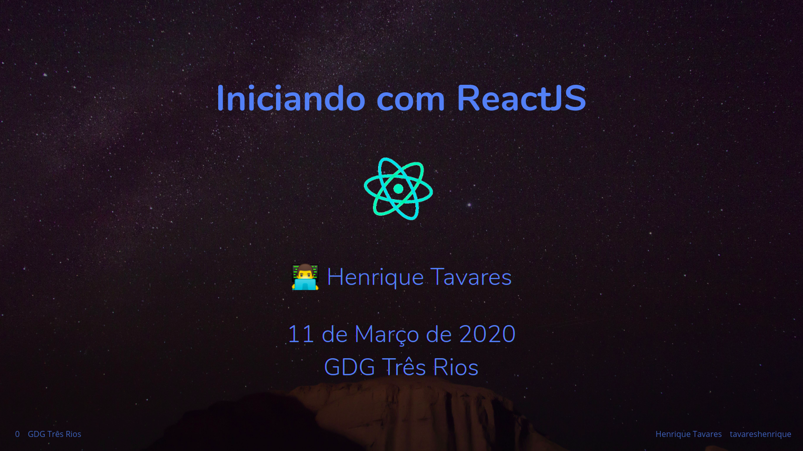

# Iniciando com ReactJS

Talk sobre ReactJS para o GDG de Três Rios.

Cosntruido com [MDX Deck](https://github.com/jxnblk/mdx-deck).

# Links

> Udemy

- <https://www.udemy.com/course/reactjs-ninja-modulo-react-webpack/>

- <https://www.udemy.com/course/react-redux-pt/>

- <https://www.udemy.com/course/react-bootstrap/>

- <https://www.udemy.com/course/reactjs-aprendendo-rapido/>

- <https://www.udemy.com/course/curso-reactjs/>

- <https://www.udemy.com/course/xumes-react-criando-site-para-empresa/>

> Youtube

- <https://www.youtube.com/playlist?list=PL-u8JWLN6xasnuyXzOFtkNfdEPOG-27nP>

- <https://www.youtube.com/playlist?list=PLt3tq0MBSMpmF0g9Mh0bPx2DTZUmfjmnw>

- <https://www.youtube.com/watch?v=JMaFQMuaro0&t=2116s>

- <https://www.youtube.com/playlist?list=PLe4SO60BV_r0hkjGFaGcmHCtmD5EUzDxM>

> Rocketseat

- <https://rocketseat.com.br/starter>

- <https://www.youtube.com/rocketseat>

- <https://rocketseat.com.br/gostack>

- <https://rocketseat.com.br/week/inscricao/11.0>

## Agradecimentos

- [Brent Jackson](https://github.com/jxnblk) por criar o [mdx-deck](https://github.com/jxnblk/mdx-deck);
- [John Otander](https://github.com/johno) e a equipe por trás do [MDX](https://github.com/mdx-js/mdx);
- [Leonardo Procópio](https://github.com/leoeek) por me convidar para falar;
- [Josh Dzielak](https://github.com/dzello) pelo template;
- [Netlify](https://netlify.com/) por hospedar os slides;
